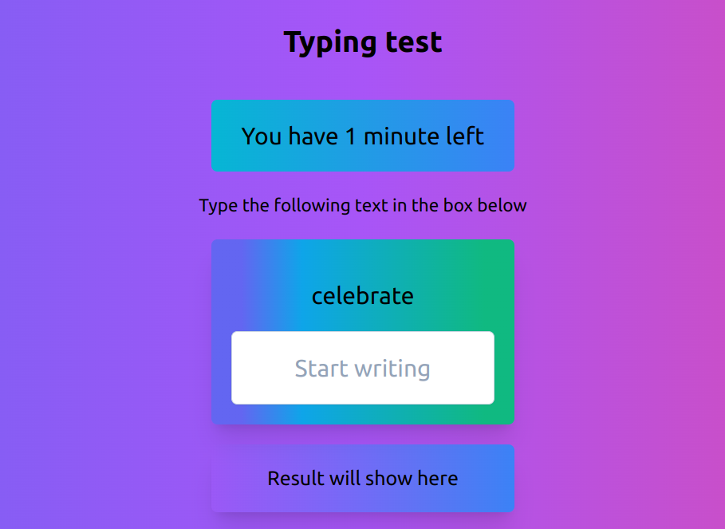

# Typing Speed Web Application

Welcome to the Typing Speed Web Application! This web app is designed to help users improve their typing speed and accuracy. Users can test their typing skills by typing a given text as quickly and accurately as possible. The application provides real-time feedback on typing speed, accuracy, and errors.



## Features

- Test your typing speed and accuracy with a variety of texts.
- Real-time feedback on your typing speed and errors.
- Simple and intuitive user interface.
- Built using HTML, Vanilla JavaScript, and Tailwind CSS.

## Usage

Visit the live Typing Speed Web Application: [https://typing-speed-test-ochre.vercel.app/](https://typing-speed-test-ochre.vercel.app/)

1. Open the provided link in your preferred web browser.

2. Choose a text to type from the available options.

3. Start typing the displayed text in the provided input area.

4. Your typing speed, accuracy, and errors will be displayed in real-time as you type.

## Demo

You can see the live demo of the Typing Speed Web Application [here](https://typing-speed-test-ochre.vercel.app/).

## Logical code

```javascript
textElement.addEventListener("keydown", (e) => {
  if (initTime === 0) {
    initTime = new Date();
  }
  timing = setInterval(() => {
    time = Math.floor((new Date() - initTime) / 1000); // calculate the time in seconds
    if (time === 60) {
      // Chceck if the time is over
      endGame();
      timeElement.innerHTML = `Time Up!!`; // show the remaining time to the user in seconds
      return;
    } else if (time < 60) {
      timeElement.innerHTML = `Time remains ${60 - time} second`; // show the remaining time to the user in seconds
    }
  }, 1000);
  if (e.key === " " || e.key === "Enter") {
    if (textElement.value.trim() === wordElement.innerHTML) {
      // check if the word is correct
      correctWords++;
    } else {
      incorrectWords++; // if the word is incorrect
    }
    const newWord =
      wordList[Math.floor(Math.random() * wordList.length)].toLowerCase();
    wordElement.innerHTML = newWord;
    textElement.value = "";
  }
});
```

## Contributing

Contributions are welcome! If you find any issues or have suggestions for improvements, please feel free to open an issue or submit a pull request.

## License

This project is licensed under the [MIT License](LICENSE).

---

Happy typing!

For more projects, visit [Code & Cognition](https://code-n-cognition.vercel.app/).
